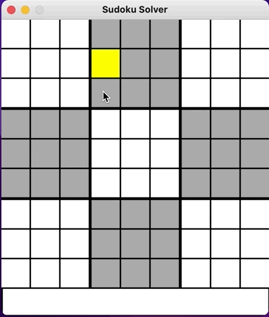
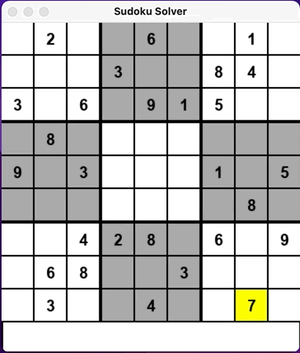
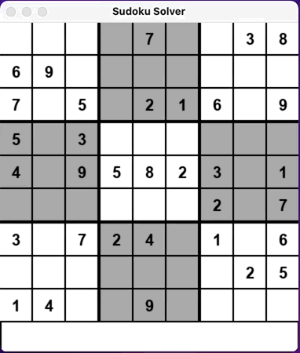

# Sudoku Solver

Sudoku solver made using Python and the module pygame for the interface to input numbers. This solver implements the backtracking recursive method for solving puzzles. Will be implementing more methods to optimise the solver soon

This solver also provides the functionality to show visually the algorithm / method being used to solve

## Backtracking

This is a brute force method of sorts, it involves starting from an empty cell then iterating through all empty cells in some order filling in digits sequentially.

If it reaches an empty cell and can't fill in any digits due to conflicts then it will 'backtrack' to the previous cell and change the value to the next valid digit

This process will repeat until reaching the last empty cell to be checked, by which point the puzzle will be solved


## Run Locally

Clone the project

```bash
  git clone https://github.com/ckasina/sudoku-solver.git
```

Go to the project directory

```bash
  cd sudoku-solver
```

Install dependencies

```bash
  python3 -m venv env
  python -m pip install -r requirements.txt
```

Start the program

```bash
  python gui.py
```

## How to Use
You can navigate the cells either using the mouse or arrow keys, fill in the numbers using keys 0-9 and backspace (0 and backspace will clear the selected cell)

Control keys include:
* C: Clear grid
* Spacebar: Solve puzzle with no animation
* V: Solve puzzle with animation (V)isually
* P: Pause the solve (only when solving visually)

## License

*NOT FOR COMMERCIAL USE*: If you have the intention of using all / any portion of my code for commerical use please contact me and request permission

## Screenshots






